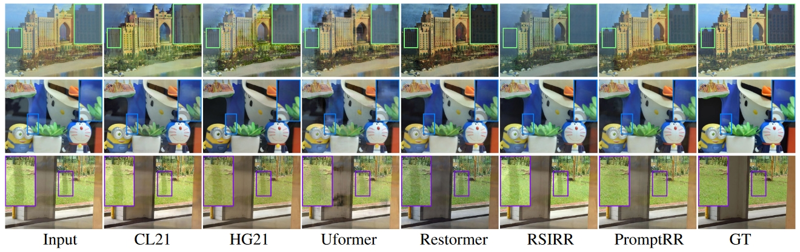
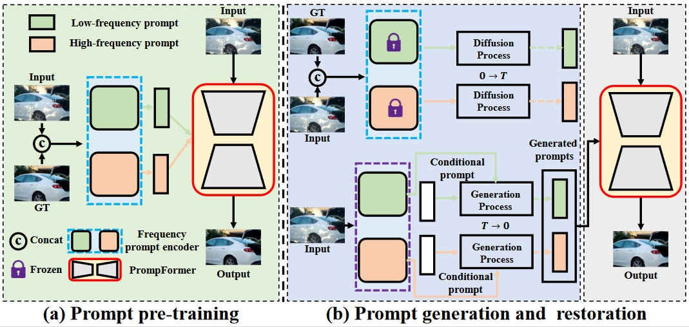
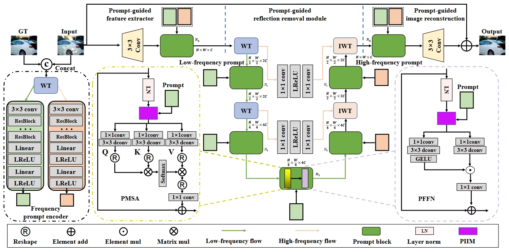

<div align="center">


<h1>PromptRR:<br> Diffusion Models as Prompt Generators for Single Image Reflection Removal</h1>

<div>
    <a href='https://taowangzj.github.io/' target='_blank'>Tao Wang</a>&emsp;
    <a href='https://longlongaaago.github.io' target='_blank'>Wanglong Lu</a>&emsp;
    <a href='https://zhangkaihao.github.io/' target='_blank'>Kaihao Zhang</a>&emsp;
    <a href='https://whluo.github.io/' target='_blank'>Wenhan Luo</a>&emsp; 
    <a href='https://sites.google.com/view/tkkim/' target='_blank'>Tae-Kyun Kim</a>&emsp;
    <a href='https://cs.nju.edu.cn/lutong/index.htm' target='_blank'>Tong Lu</a> <br>
    <a href='https://scholar.google.com/citations?user=Mq89JAcAAAAJ&hl=ja&oi=ao' target='_blank'>Hongdong Li</a>&emsp;
    <a href='https://faculty.ucmerced.edu/mhyang/' target='_blank'>Ming-Hsuan Yang</a>
</div>

<!--<sup>∗</sup>-->
<!--
<div>
    State Key Laboratory for Novel Software Technology, Nanjing University, &emsp; Memorial University of Newfoundland, &emsp; Harbin Institute of Technology,&emsp; Sun Yat-sen University,&emsp; Imperial College London,&emsp; Australian National University,&emsp; University of California Merced,&emsp; Google Research 
</div>
-->

<div>
    <h4 align="center">
        <a href="https://taowangzj.github.io/projects/PromptRR/" target='_blank'>
        
        </a>
        <a href="https://arxiv.org/pdf/2402.02374.pdf" target='_blank'>
        
        </a>
        </a>
        
    </h4>
</div>


<strong>PromptRR is a diffusion-based model that uses frequency information as new visual prompts for single-image reflection removal.</strong>

<div style="width: 100%; text-align: center; margin:auto;">
    
</div>

:open_book: For more visual results, see our <a href="https://taowangzj.github.io/projects/PromptRR/" target="_blank">project page</a>


---

</div>

<div style="text-align: justify">Current single image reflection removal (SIRR) methods using deep learning tend to miss key low-frequency (LF) and high-frequency (HF) differences in images, affecting their effectiveness in removing reflections. To address this problem, this paper proposes a novel prompt-guided reflection removal (PromptRR) framework that uses frequency information as new visual prompts for better performance. Specifically, the proposed framework decouples the reflection removal process into the prompt generation and subsequent prompt-guided restoration. For the prompt generation, we first propose a prompt pre-training strategy to train a frequency prompt encoder that encodes the ground-truth image into LF and HF prompts. Then, we adopt diffusion models (DMs) as prompt generators to generate the LF and HF prompts estimated by the pre-trained frequency prompt encoder.  For the prompt-guided restoration, we integrate specially generated prompts into the PromptFormer network, employing a novel Transformer-based prompt block to effectively steer the model toward enhanced reflection removal. The results on commonly used benchmarks show that our method outperforms state-of-the-art approaches.</div>


## 🔥 Update
- [2024.2.06] This repo is created and the code will come soon!
## 🎬 Overview
<div align="center">

---

</div>

## Citation
If our PromptRR helps your research or work, please consider citing:

```
@article{wang2024promptrr,
  title={PromptRR: diffusion models as prompt generators for single image reflection Removal},
  author={Wang, Tao and Lu Wanglong and Zhang, Kaihao and  and Luo, Wenhan and and Kim, Tae-Kyun and Lu Tong and Li, Hongdong and Ming-Hsuan Yang},
  journal={arXiv preprint arXiv:2402.02374},
  year={2024}
}
```
## 📧 Contact
If you have any questions, please reach us at `taowangzj@gmail.com` or `wanglongl@mun.ca`. 
